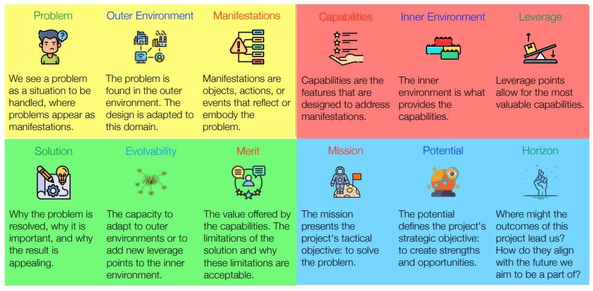

## Roles
- Child: Any team member exploring the situation. Unorthodox and creative. Offers ideas and proposals without responsibility. Questions conventional views on uses, needs, users, and the application of technology. This Role is fleeting.
    - Can raise any question and make propositions contrary to previous decisions.
    - Is above responsibility and critique.
    - Is the main source of ideas.
    - Any person engaging in dialogue about the situation assumes the child role.
    - Outsiders can also take this role.
    - Contributions:
        - Ideation
        - Detailing
        - Evaluation
        - Situation/Contribution maturation

- Responder: Any developer working on the contribution. Offers technological responses to challenges—always with a view to technological options and affordances that come up during the design process.
    - Are developers and normally have majority.
    - Come up with ambitious responses using their
        technological expertise.
    - Responders and challenger(s) constantly
        discuss how needs and desires are met.
    - Contributions:
        - Point to options when building contributions
        - Evaluate strengths, weaknesses, opportunities, and threats
        - Technical perspective on idea
        - Evaluate feasibility and potential of capabilities

- Challenger: The team member who provides the reasoning and politics underlying the solution. Aiming for a solution with a good balance between problem and contribution in the specific situation. Open to new ideas and good arguments.
    - Is the customer or surrogate customer honoring customer interests.
    - Is a main source of domain knowledge.
    - Formulates and explains the situation, prioritizes features, and accepts solutions.
    - There may be more than one challenger.
    - Contributions:
        - Identify main manifestations
        - Develop ideas
        - Prioritize and formulate value propositions
        - Accept/reject contributions

- Anchor: The team member in charge of valuation. A team captain (although not a team manager) who facilitates credible evaluations and provides a reasonable basis for decisions on whether to pivot or persevere.
        - Is not a team leader but is responsible to keeping the team absorbed.
        - Leads evaluations but does not decide.
        - Intervenes and removes threats to the team.
        - Contributions:
            - Ensure team is functional and productive
            - Suggest and adapt methods, techniques and tools
            - Ensure fairness in evaluations
            - Take care of "foreign affairs"

---

## Activities
- Perceive (Child): understanding the problem and its context
- Form (Responder): designing the constructive parts of a solution
- Consolidate (Challenger): integrating the design contribution into a clear whole that addreses the situation
- Learn (Anchor): appraising the design

---

## Abstractions
- Rationale: the logical basis that makes actions meaningful and helps reason about strategy and tactics for solving the overall problem.
- Strategy: the master plan for solving the overall problem, including the scope of the problem, the key components for building the solution, and qualifications regarding limitations and constraints that may affect the utility or acceptability of a solution.
- Tactics: actions planned in accordance with the strategy to achieve specific ends.

---

## Cells
- Perception:
    - Problem: A problem reflects an understanding of a situation. Problems have no objective status. 
        - We see a problem as a situation to be handled, where problems appear as manifestations.
    - Outer Environment: The surroundings in which our problem resides and where the contributions we design will operate. 
        - The problem is found in the outer environment. The design is adapted to this domain.
        - 
        -
        -
    - Manifestations: An object, event, or action that reflects or gives a tangible or visible form to the problem. 
        - Manifestations are objects, actions, or events that reflect or embody the problem.
            - Abstract
            - Concrete
- Forming:
    - Leverage: Keystones of the inner environment that help create a great contribution.
        - Leverage points allow for the most valuable capabilities.
        - Technolology: Scientific knowledge, machinery, and equipment on which a design might be based.
        - Components: Rare equipment, sensors, or actuators used actively in building a solution and accessed via crafted interfaces.
        - Information: Used for collecting, storing, disseminating, and/or aggregating information to be accessed via crafted interfaces.
        - Human resources: Specific users, categories of users, experts, authorities, social or professional net- works, organizations, or others with particular roles or functions designed to build a solution. Cyberhuman systems are prominent examples of systems where internal people are leverage points.
    - Inner Environment:  The substance and organization of what we design and implement.
        - The inner environment is what provides the capabilities.
        -
        -
        -
    - Capabilities: An ability or facility devised to handle manifestations as part of a solution that provides value. 
        - Capabilities are the features that are designed to address manifestations.
    
- Consolidation:
    - Solution: Why the problem is resolved, why it is important, and whi the result is appealing.
        - Prospect: what we believe to be a solution if used properly.
        - Warrant: why solving the problem is essential
        - Backing: why the proposed contribution provides an attractive solution to the problem.
    - Evolvability: The capacity to adapt to outer environments or to add new leverage points to the innter environment.
        - Diffusibility
        - Adoptabilty
    - Merit: The value offered by the capabilities. The limitations of the solution and why these limitations are accceptable.
        - Value
        - Reservation
        - Rebuttal
- Learning:
    - Horizon: Where might the outcomes of this project lead us? How do they align with the future we aim to be a part of?
        - H1: business as usual, daily operations
        - H2: 
        - H3: long-term future
    - Potential: The potential defines the project's strategic objective: to create strenghts and opportunities.
        - 
    - Mission: The mission presents the project's tactical objective: to solve the problem.
    

## Context Types
- Simple: known knowns, clear causes and effect. Sense, categorize and respond.
- Complicated: known unknowns, clear cause and effect are discoverable but not obvious to anyone. Sense, analyze and respond.
- Complex: unknown unknowns, cause and effect can only be deduced in retrospect. Probe, sense and respond.
- Chaotic: unknowable unknowns, no cause and effect relationships can be established, just emergent patterns. Act, sense and respond.

- Philosophers and main points
- Definitions of innovation
- Types of innovation?

## Scenarios
Made up of axes
    - Why/Who?
    vs
    - What/Where/When/How/How much?

## Analysis
- PCRT: Power, Cost, Risk, Time
    - Qualitative
    - Quantitative

- Digital Innovation Defined
Products, services, processes, or business models that
emerge within or between business units and where
digital technology is a key factor in triggering or enabling
value
- Digital Innovation Types
    - Product: New or radically changed products or services
    - Process: New or radically improved ways to produce products or services
    - Position: Products, services, processes, or business models that emerge by fitting earli- er solutions into new uses 
    - Paradigm: Products, services, processes, or business models that emerge from radical changes in the mental models of what a business is; who the users are; or what the market is

- Innovation window:

## Philosophy
- John Dewey: Pragmatism #TODO
    - Means: instruments used to attain an end
        - Material
        - Procedural
    - End: 
    - End-in-view: is an idea of an end to be reached at the current point in time, the consequence of taking a step towards an end.
        - Mission EIV
        - Horizon EIV
    - Idea (hypothesis): 
    - Suggestion
    - Transaction (back-talk): the process of testing an idea by acting on it and observing the consequences
    - Inquiry: controller transformation of an indeterminate situation into a determinate one so that its elements form an unified whole.
        - Transactionsl, open-ended and inherently social
        - Ideational and existential operations
- Donal Schön
- Theory-ladden?

## Secondary concepts
- Paradigms of design/change:
    - Document-oriented: Top-down, static, plan-oriented
    - Agile: incremental, dynamic, user-oriented
    - Pragmatic: problem- and solution-oriented

- Factors of change:
    - Anthropocene:
    - Knightian uncertainties (and opportunities):
    - Hypercomplexity: is a degree of complexity which inhibits or makes impossible rational decision making within reasonable time constraints
    - Problems and solutions are interdependent: problems and solutions shape each other
    - Design takes place in a VUCA world (volatile, uncertain, complex, ambiguous)

## PSC/Essence critique
- : The order of the building blocks does not follow the same axis of rotation wrt the psc canvas consistently.
