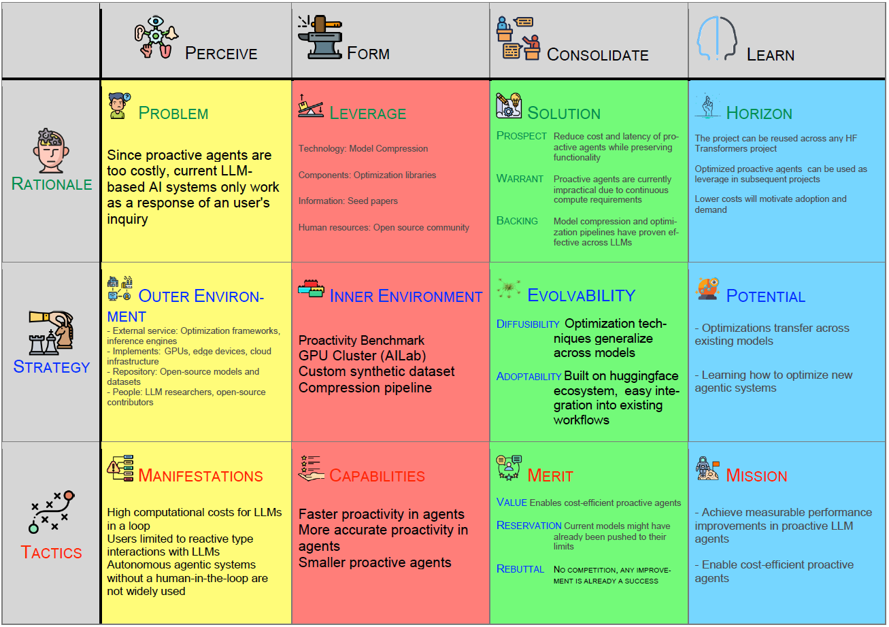

# Software Innovation mini-project

**Author**: Beltrán Aceves Gil

**Study program**: CS-IT-09

**Date:** 13/05/2026



---

## Table of Contents
- [0. Project Description](#0-project-description)
- [1. Innovation Opportunities](#1-innovation-opportunities)
- [2. Innovation in our project](#2-innovation-in-our-project)
- [3. Selecting a Fulcrum](#3-selecting-a-fulcrum)
- [4. Problem Scenarios](#4-problem-scenarios)
- [5. Leverage Scenarios](#5-leverage-scenarios)
- [6. Solution Scenarios](#6-solution-scenarios)
- [7. Horizon](#7-horizon)
- [8. Strategy and Outer Environment](#8-strategy-and-outer-environment)
- [9. Inner Environment](#9-inner-environment)
- [10. Evolvability and General Innovation Theory](#10-evolvability-and-general-innovation-theory)
- [11. Tactics, Manifestations and Capabilities](#11-tactics-manifestations-and-capabilities)
- [12. Merit](#12-merit)
- [Use of generative AI](#a-note-on-the-use-of-generative-ai)
- [Thoughts](#thoughts-on-essence-the-problem-solution-canvas-and-the-lectures)

---

## 0. Project Description

This mini-project makes use of our semester project as the domain to use the Problem-Solution Canvas.

We seek out to improve proactive agents, LLM-based systems that interact with their users and the environment not only when directly prompted, but rather are able to initiate both information gathering and communication from the agent's side.

Implementations of this emerging paradigm have recently started to appear, but rely on keeping the agent in a loop, constantly consuming resources, which we aim to reduce by trying to heavily optimize the process.

---

## 1. Innovation Opportunities
### 1.1 Do you see trends in technology that might be related to your topic?

- LLMs are incresingly popular. Both the effort and capital invested into them from both academia and industry keeps growing, as well as their user bases.
TODO: add chart for AI funding
- LLM-based agents like Claude Code, OpenClaw or Codex have amassed vocal and enthusiastic communities, stimulating further development in this paradigm.
TODO: add chart with gh stars for openclaw
- We are going through a period of explotion in this domain, and many companies and institutions are trying to uncover the next evolution in this space.

### 1.2 Do you see trends in legislation, society, culture, and economy that might be linked to your topic

- **Legislation**: regulations like the EU AI Act signal increasing governance of AI systems. Export restrictions (e.g., GPU exports to China) reflect geopolitical concerns around AI capability distribution.
- **Society**: we can already observe people getting divided in groups depending on their stance towards generative ai. Two main axes stand out: 
   - Those who believe LLMs can achieve all that is being promised and those who don't.
   - Those who regard the impact of generative ai as something positive and those who find it negative.
- **Economy**: organizations increasingly expect AI-assisted systems to deliver productivity gains. This economic demand is driving both adoption and quality expectations for AI tools. It is also functioning as a convenient smokescreen for layoffs and restructuring of company hierarchies and salary expectations.
- **Cultural**: computer-aided art tools have been widely accepted, but AI-generated creative content (music, video, paintings, writing) is largely rejected as inauthentic and not considered art by the vast majority.

### 1.3 Do you see new forces in industry and markets, new needs and demands, new products, and new conditions relevant to you topic?
Yes, the clearest examples of which are projects like OpenClaw. It's a general purpose executive assistant application that can perform work in the background. Even at it's current barely developed stage, it has taken the enthusiast community by storm, to the point of the creator being hired by Anthropic. 
OpenClaw illustrates the combiation of multiple forces in the domain: agent architectures, tool calling, context management, MCP protocols, open-source momentum, growing competition from major players like Anthropic and OpenAI acquiring emerging projects, and the fundamental market demand for alternative interaction models beyond static prompting.


### 1.4 How can such trends and forces create innovation opportunities in your project?

An environment like this is full of players building different solutions. By bouncing off their ideas we can explore new directions. The open-source community is a great enabler, as it produces excellent tools for everyone to build upon, which makes it practical for us to iterate on otherwise unatainable projects.

---

## 2. Innovation in our project

### 2.1 What problem are you working on?

Existing proactive LLM agents (like ContextAgent) are too expensive to deploy at scale. They need constant resources to keep running, constantly scanning for opportunities to act. This computational cost makes them impractical for most use cases, as they only make sense where the investment is clearly justified.

### 2.2 What type of digital innovation are we pursuing?

Following Table 1.1 in Essence, we clasify this as **Position Innovation**. We're taking existing proactive agent technology and making it cost-efficient by dramatically reducing its computational demands.

Using optimization techniques like quantization, pruning, and knowledge distillation, we can take expensive proactive agents and make them economically viable. This enables proactive agents in scenarios where they were previously too costly, unlocking value by bringing existing solutions into new economic contexts.

### 2.3 What will be the keystones in your design? What will make your design stand out?

Our design targets the HuggingFace Transformers library, the most widely used library for LLMs. By implementing our optimization techniques at this abstraction level, we can translate the improvements for most open-source LLMs, not just ContextAgent. This way, our project becomes a multiplying force in an ecosystem, rather than an incremental improvement in a particular situation.

### 2.4 Who will benefit from it? What value will you create?

Benefitiaries:
- Current LLM users seeking alternative ways to interact with their systems
- Organizations deploying proactive AI systems at scale
- Users with accessibility needs who benefit from agent-initiated (hands-free) communication

Value propositions
- Enjoy LLM capabilities without continuous human-initiated prompts
- Deploy proactive systems in environments with more constrained operating margins
- Enable a new kind of LLM-based product within the proactive paradigm, like personal assistants

### 2.5 Where will it be used? How will it create change? Characterize your problem or solution challenges in terms of volatility, uncertainty, complexity and ambiguity (Section 1.2 in Essence)

The improved proactive agent can be deployed in affordable cloud services, on-device systems, or resource-constrained environments. 

The biggest change it could enable would be to popularize a different way of interacting with LLMs by moving away from the prompt-based paradigm into a more implicit type of interaction in which the LLM is ready for us at all times by being proactive.

**VUCA**:

| Dimension | Assessment | Implications |
|-----------|-----------|---| 
| **Volatility** | LLM landscape evolves rapidly; new models and architectures emerge frequently | Must design for flexibility; avoid tight coupling to specific model architectures |
| **Uncertainty** | Optimization techniques' effectiveness on proactive tasks remains empirically unvalidated | Approach must be focused on experiments with clear success criteria |
| **Complexity** | Proactive agent behavior emerges from multi-component interactions; optimization effects may be nonlinear | Build and test the system in an incremental manner, ablating components and interactions when neccesary |
| **Ambiguity** | User expectations for "proactive" behavior are poorly defined and context-dependent | Keep the use cases open for new scenarios instead of locking into a particular one |

### 2.6 Do you consider your project to be mainly demand-pull or technology-push? (Section 1.2 in Essence)

We consider our project **primarily technology-push**. While a small but vocal community demands proactive AI systems, mainstream adoption/demand remains a question. We are mostly pursuing a new oportunity emerging from new technologies.

### 2.7 Will roles be relevant? How? When? What are the pros and cons of roles?

In research-heavy work like ours, the **Child** and **Responder** roles matter most, while the **Challenger** and **Anchor** take a step back. We need someone generating new ideas and someone actually building and testing them. The other roles help, but when you're exploring unknown territory without a focus on a final product or future oportunities, the two latter roles derive less value.

While Essence presents roles as a somewhat fluid element someone embodies, there's a tendency for people to shoehorn themselves if they are not careful. Roles help teams set and meet expectations with each other, and help manage both the project and their members, but the specific roles and who embodies each one must not be final decisions.

---

## 3. Selecting a Fulcrum

We opted to choose **Mission** as our PSC Fulcrum because it very clearly aligned with the incremental research perspective our project would follow (Essence, page 69):

- **Quantifiable Objectives** and **Measurable Environment**: Our project involves well-defined performance metrics (latency, token throughput, model size reduction, F1 scores), and the optimization landscape provides clear benchmarks (GLUE scores, inference time, memory usage)
- **Incremental Progress:** Mission-driven approaches naturally accommodate the hypothesis-test-refine cycle required in research, which we make use of by employing ContextAgent as our starting point
- **Alignment:** Our focus on optimization techniques creates clear missions: "Reduce model size by X% while maintaining Y% accuracy"

**Strategy**:

- Establish a baseline:
   - Profile ContextAgent under standard conditions
   - Define success metrics (inference latency, token throughput, accuracy)
   - Establish reproducible evaluation methodology

- Apply optimizations:
   - Implement and test quantization, pruning, semantic steering, etc
   - Measure effects on baseline metrics

- Analysis and iteration:
   - Identify optimal technique combinations
   - Document trade-offs (accuracy vs. speed, complexity vs. efficiency)
   - Refine our approach based on results

- Synthesis:
   - Formulate principles for general proactive agent optimization
   - Develop recommendations for deployment scenarios

### Initial PSC Canvas
As outlined in Essence (Table 4.6), we start our PSC by filling in the *tactics* abstraction and the *learn* activity:

TODO insert psc_mini screenshot 
<!-- 
**Mission:** Achieve measurable performance improvements in proactive LLM agent efficiency through systematic optimization

**Manifestations** (what makes the problem tangible): 
- High computational cost per agent operation
- Continuous resource consumption while agents wait for opportunities to act
- Economic barriers to broad deployment

**Capabilities** (designed features addressing manifestations):
- Efficient context management
- Optimized token processing  
- Low-latency decision making

**Merit** (value offered and limitations):
- *Value:* Proactive agents become economically viable for new deployment scenarios; ecosystem-wide optimization benefits
- *Reservation:* Optimization may degrade context understanding below acceptable thresholds; technique effectiveness on proactive tasks remains empirically unvalidated
- *Rebuttal:* Sequential measurement and ablation studies provide strong empirical foundation for understanding tradeoffs

**Horizon** (where outcomes lead; strategic hypotheses for the future):

The horizon links this project's immediate results to the team's long-term direction. We formulate three core hypotheses:

**Problem Hypothesis (Generic & Reusable):**
Computational efficiency is a fundamental barrier to adopting proactive LLM agents across diverse deployment contexts. This problem is generic—it applies to all proactive agent systems, not just ContextAgent, and will be relevant as the proactive agent paradigm evolves. Success criteria: adoption by a significant class of organizations currently unable to deploy proactive systems due to cost.

**Leverage Hypothesis (Strategic for Current & Future Projects):**
Optimization techniques (quantization, pruning, knowledge distillation) at the HuggingFace Transformers abstraction level are keystones for this project and strategically vital for future work. By building optimization expertise and components now, we create reusable leverage points for optimizing future agent architectures and LLM systems. Success criteria: optimization techniques transfer to new agent architectures with minimal rework; techniques become team capability differentiator.

**Solution Hypothesis (Market & Value):**
- *Prospect (leap of faith):* Computational efficiency can be achieved in proactive agents without degrading behavior quality below acceptable thresholds
- *Warrant (growth):* Cost reduction addresses a significant market: organizations with resource constraints, edge deployments, and cost-sensitive operations. Viable proactive agents enable a new product category and use cases currently impossible
- *Backing (value):* Lower deployment costs create sufficient economic value to motivate adoption; benefits (operational savings, new capabilities) exceed optimization effort

**Potential** (strategic opportunities):
- Optimization principles transfer across agent architectures
- Meta-optimization: learning how to optimize new agent systems
- Commercial positioning for optimization consulting or specialized licensing

**Related Elements** (for completeness):
- **Outer Environment:** Rapidly evolving LLM infrastructure, competing agent platforms, resource constraints, open-source ecosystem
- **Inner Environment:** ContextAgent architecture, optimization component library, evaluation framework, metrics collection system
- **Leverage Points:** Model quantization, architecture pruning, knowledge distillation, batching strategies -->

---

## 4. Problem Scenarios

### 4.1 Describe the context type of your project as defined in Table 6.1

We classify our project context as **Complex**. Deep learning systems are black boxes and we cannot reason our way through their behavior by inspection. However, unlike true Knightian uncertainties it is not unknowable in principle. With sufficient effort, some level of understanding is achievable, such as the domain of mechanistic interpretability.

In this context, we learn through structured experimentation: form a hypothesis about how an optimization technique will affect performance, run the experiment, observe the actual response, and adjust our mental model accordingly.

### 4.2 Develop axes for Problem Scenarios as described in Section 6.3

**Axis 1 (Horizontal): How — Interaction Model**
- *Reactive* — Human-initiated; users control when and what
- *Proactive* — Agent-initiated; agents decide autonomously

**Axis 2 (Vertical): How Much — Cost**
- *Affordable* — Operating costs fit within practical budgets
- *Costly* — Operating costs exceed practical justification

### 4.3 Develop Problem Scenarios as illustrated in Figure 6.1

|  | **Affordable** | **Costly** |
|---|---|---|
| **Reactive** | Orchestration and coordination | Infrastructure scaling |
| **Proactive** | Scaling and diffusion | Cost reduction and efficiency |

### 4.4 Choose one problem to work with from now on 

Current LLM-based AI systems only work as a response of an user's inquiry and proactive agents are too costly to deploy; economic barriers block adoption.

### 4.5 Outline how this problem manifests itself

- Users limited to reactive type interactions with LLMs
- High computational costs for LLMs in a loop
- Autonomous agentic systems without a human-in-the-loop are not widely used


### 4.6 Outline the Outer Environment of your project

**External Services:** Optimization frameworks, inference engines

**External Implements:** Acceleration hardware, edge devices

**External Repositories:** Open source models, datasets

**External People:** LLM researchers, open-source community

---

## 5. Leverage Scenarios

### 5.1 Suggest leverage points for your project

**Technology:** Model compression techniques (quantization, pruning, distillation), more efficient architectures (Mamba, LeWM)

**Components:** Optimization libraries (GPTQ, Ollama), resource constrained inference engines (vLLM, Unsloth)

**Information:** Open source datasets, seed papers (ContextAgent)

**Human Resources:** Well-funded independent LLM researchers, open source contributors

### 5.2 Evaluate and select leverage points. Use PCRT-analysis

### PCRT Analysis

| Leverage Point | Power | Cost | Risk | Time | Total |
|---|---|---|---|---|---|
| **Model Compression Techniques (Technology)** (quantization, pruning, distillation) | 9/10 | 1/10 | 2/10 | 2/10 | 4 |
| **Efficient Architectures (Technology)** (Mamba, LeWM) | 8/10 | 2/10 | 3/10 | 4/10 | -1 |
| **Optimization Libraries (Components)** (GPTQ, Ollama) | 7/10 | 1/10 | 2/10 | 2/10 | 2 |
| **Inference Engines (Components)** (vLLM, Unsloth) | 7/10 | 2/10 | 2/10 | 2/10 | 1 |
| **Seed Papers (Information)** | 6/10 | 1/10 | 1/10 | 2/10 | 2 |
| **Open source contributors (Human resources)** | 5/10 | 2/10 | 3/10 | 2/10 | -2 |

### 5.3 Develop axes for the Leverage Scenarios as described in Section 7.3

**Vertical Axis: WHO**
- *Seed Papers* — Theoretical foundation; research publications validating compression techniques
- *Open Source Contributions* — Practical implementations; community-driven tools and libraries

**Horizontal Axis: HOW**
- *Model Compression* — Apply optimization techniques to existing models (quantization, pruning, distillation)
- *Efficient Architectures* — Design or adopt new architectures inherently suited to resource constraints (Mamba, LeWM)

### 5.4 Develop Leverage Scenarios as illustrated in Figure 7.1

|  | **Model Compression** | **Efficient Architectures** |
|---|---|---|
| **Seed Papers** | Theoretical optimization: validate compression techniques empirically, publish benchmarks | Architecture innovation: introduce new paradigms, theoretical performance bounds |
| **Open Source Contributions** | Production tools: implement compression libraries, integrate into deployment pipelines | Community-driven architectures: adopt and adapt efficient designs, contribute optimizations |

### 5.5 Choose one scenario to work with from now on
We've decided to select Open Source Contributions + Model Compression as our scenario. The intent is to build and integrate practical compression tools into the ecosystem, leveraging existing models and libraries to achieve more cost-efficient deployments.

### 5.6 Discuss the most important leverage points you plan to use in your project

- **Model Compression Techniques** (Technology) — Quantization, pruning, distillation directly enable efficient proactive agents.

- **Optimization Libraries** (Components) — Pytorch Lightning, Ollama provide production-ready implementations reducing engineering overhead.

- **Seed Papers** (Information) — Agentic proactiveness research validates theoretical foundation and provides technique baselines.

- **Open Source Community** (Human Resources) — Contributes tools, feedback, and adoption momentum enabling ecosystem-wide impact.

### 5.7 Discuss the capabilities obtainable through these leverage points

- **Faster Proactivity in Agents:** Compression reduces model latency; optimized pipelines enable inference in edge devices.

- **More Accurate Proactivity in Agents:** Systematic ablation identifies accuracy-preserving optimizations and seed papers guide trade-off decisions.

- **Smaller Proactive Agents:** Quantization and pruning reduce model sizes significantly while maintaining accuracies close to their baseline.

### 5.8 Discuss the Inner Environment of your design

- **Proactivity Benchmark** — Evaluation pipeline for any model + technique combination
- **GPU Cluster (AILab)** — Computational infrastructure for training models and running experiments
- **Custom Synthetic Dataset** — List of scenarios with desired proactivity levels
- **Compression Pipeline** — Sequential implementation of quantization, pruning, distillation techniques

---

## 6. Solution Scenarios

### 6.1 Develop axes for the Solution Scenarios as described in Section 8.3

**Vertical Axis: WHERE — Problem Perspective**
- *New Interaction Paradigm* — Enable entirely new ways of interacting with LLMs beyond reactive prompting
- *Add to Existing Products* — Augment existing LLM products with new capabilities

**Horizontal Axis: HOW — Contribution Approach**
- *Optimize Existing Models* — Apply compression and optimization techniques to current models
- *Develop New Models* — Design or adopt architectures inherently suited to proactive deployment

### 6.2 Develop Solution Scenarios as illustrated in Figure 8.1

|  | **Optimize Existing Models** | **Develop New Models** |
|---|---|---|
| **New Interaction Paradigm** | Efficient proactive agents enabling new interaction model | Novel proactive architectures establishing new paradigm |
| **Add to Existing Products** | Optimization as feature in existing LLM products | New proactive agent product line within existing organizations |

### 6.3 Explain the Solution Scenarios you find in each quadrant

**Quadrant I (New Paradigm + Optimize Existing):** Prove proactive agents are economically viable by optimizing existing models

**Quadrant II (New Paradigm + Develop New):** Design proactive-native architectures from the ground-up

**Quadrant III (Add to Existing + Optimize Existing):** Add proactive mode as a feature to existing products

**Quadrant IV (Add to Existing + Develop New):** Build new proactive product line within existing organizations

### 6.4 Choose one scenario to work with from now on

We select **Quadrant I (New Interaction Paradigm + Optimize Existing Models)** as our primary approach.

**Prospect:** Our project reduces the cost and improves the accuracy of proactive agents.

**Warrant:** Current LLMs operate mostly in reactive mode. The market lacks proof that efficient proactive operation is possible or desired.

**Backing:** Successfully optimizing existing models for proactive agents opens new use cases, making way for a paradigm shift in human-agent interaction.

### 6.5 Discuss short-term strengths and weaknesses of your chosen scenario

**Strengths:**
- Uses existing models instead of building new ones, which reduces technical risk
- Can show results quickly within the project timeline
- Cheaper for early users to adopt the same model with less cost
- Creates early proof that the market wants optimized proactive agents

**Weaknesses:**
- We're limited by how much existing models can be optimized
- Other people can use the same optimization techniques, so it's not unique
- Early agents might not feel great because they're built on reactive models
- We need to accept that optimized models have built-in trade-offs

### 6.6 Discuss longer-term strengths and weaknesses of your chosen scenario

**Strengths:**
- Our research becomes the standard that new architectures are built with
- We can do consulting work as new models come out
- Our performance data becomes a valuable asset
- Big companies invest in optimized proactive agents through our technology

**Weaknesses:**
- Bigger companies build better new models faster and make our work obsolete
- New models come out faster than we can optimize them
- Nobody actually wants proactive agents, so our work doesn't matter
- Better new systems make optimization unnecessary
- Companies absorb our team or idea before our work has full value

---

## 7. Horizon

### 7.1 Will your horizon be affected by the technology push? What and how?

New optimization frameworks and hardware accelerators are constantly emerging. If we design our techniques around specific tools or hardware, they'll become obsolete quickly. Instead, we need to focus on general optimization principles that work across different architectures and hardware, so our work stays relevant as technology shifts.

### 7.2 Will your horizon be affected by market pull? What and how?

Right now very few organizations actually deploy proactive agents because they are a new unvalidated paradigm, and too expensive. If our optimization makes them cheap enough, demand could shift. As the market grows, our role could change from building novel techniques to becoming proactive agent specialists or consultants that companies hire to optimize their own systems.

### 7.3 Will changes in innovation type characterize your horizon? How and why?

We're currently doing position innovation, taking existing technology and making it cheaper. But if proactive agents become mainstream, optimization could shift to being its own modular component that companies can plug in. Eventually, efficient design might just be built into systems from the start, making our current optimization work seem less valuable.

### 7.4 Formulate horizon hypotheses as outlined in Table 9.1

| Dimension | Now (Present) | Later (Future) |
|---|---|---|
| **Problem** | Proactive agents cost too much to run | Cost will still be the main barrier to widespread use |
| **Leverage** | Optimization techniques are key to making this work | Optimization expertise will be valuable as things grow |
| **Prospect** | We can cut costs significantly without losing accuracy | Future systems will be designed for efficiency, not patched later |
| **Warrant** | Companies can't deploy proactive now because of cost | Cheaper proactive agents open new markets that matter |
| **Backing** | Our approach works in today's context | Our research helps us lead in this space later |

### 7.5 Outline some criteria you might use to verify or falsify your hypotheses

**Problem:** Show that cost blocks deployment now. After we optimize, measure if people actually deploy it.

**Leverage:** Use our techniques on other agent types and show similar improvements. See if others adopt our tools.

**Prospect:** Reduce costs significantly with minimal accuracy loss. Get simmilar results on different architectures.

**Warrant:** Find the new use cases that our cost reduction enables. Then, monitor if those markets grow.

**Backing:** Publish results that match what competitors do. Track if people use our open source tools.

---

## 8. Strategy and Outer Environment

### 8.1 Discuss VUCA challenges for your project

**Volatility:** LLMs change constantly. New models, hardware, and research breakthroughs appear unexpectedly. Last year's optimization might not work on this year's models. This affects us a lot because we can't predict what will be worth optimizing next.

**Uncertainty:** We don't know if our optimization techniques will work on different agent types or if the market will actually want what we build. We're developing solutions but the market needs remain unsettled.

**Complexity:** Optimization techniques interact in ways we don't understand yet. Quantization might work differently when combined with pruning. The LLM internals are black boxes. Many variables affect the outcomes. This is of very high importance because we have to build and test to discover what works.

**Ambiguity:** What counts as "good" proactive behavior varies wildly. One person wants fast response times, another wants accuracy. Deployment contexts are totally different. Requirements from potential users are unclear. This is high importance because we can't lock into one solution.

Most important for us: Complexity and Ambiguity are the biggest challenges. We don't understand how techniques interact, and we're not sure what users actually need.

### 8.2 Discuss VUCA strategies for your Outer Environment

**For Volatility:**
- Keep designs flexible. Don't lock into specific models or frameworks.
- Watch the field constantly. Monitor new LLM releases and optimization papers.
- Build general principles instead of specific implementations.
- Aligned with "Act, sense, and respond" (Strategy and Outer Environment, page 27). This will be useful because monitoring shifts are expected in LLM research, but stockpiling resources isn't practical for our project.

**For Uncertainty:**
- Test assumptions early through prototypes and experiments.
- Talk to people who might deploy our work to clarify what they need.
- Make incremental decisions as you learn, rather than planning everything upfront.
- Aligned with "Prepare contingency plans" and "isolate dependencies" (Strategy and Outer Environment, page 28). It could be useful because our stage isolation directly addresses dependencies, but we lack explicit contingency plans for when techniques fail to transfer, so we don't expect this strategy to be very effective.

**For Complexity:**
- Break optimization into separate stages that can be measured independently.
- Build models or simulations to predict how techniques will interact.
- Test combinations carefully before running the full pipeline.
- Aligned with "limiting manifestations, user categories, and dependencies" (Strategy and Outer Environment, page 29). This will be partially useful because we isolate dependencies, but refusing to limit user categories means we still face high complexity.

**For Ambiguity:**
- Engage with potential users early. Get feedback on proactive behavior.
- Run experiments to discover what works in practice.
- Stay flexible. Don't commit to one definition of "good."
- Aligned with "Probe, sense, and respond" (Strategy and Outer Environment, page 30). We could expect this to be quite useful, guiding us through unclear user demands, but the limited size and access we have to such users can give us a false sense of direction.

### 8.3 How could you use these strategies actively in your project?

- Monitor to adapt: Set a monthly check to scan for new LLM releases and optimization research. If something significant changes, re-evaluate whether our techniques still apply. This handles volatility.

- Include user feedback early: Before finalizing designs, interview 2-3 organizations that might want to deploy edge proactive agents. Ask what performance matters most to them. Cost? Speed? Accuracy? This clarifies ambiguity.

- Isolate and combine validation: Test each optimization stage separately first. Measure what each one does alone before combining them. Build a prediction model for how they interact. This manages complexity.

- Iterate in short cycles: Prototype techniques, test on real scenarios, collect feedback, and adjust. Don't try to perfect everything before learning from practice, as it is most likely that success criteria will change. This reduces uncertainty.

---

## 9. Inner Environment

### 9.1 Which conceptual models do you use to design the architecture and outline primary components in your project?

**Model 1: Optimization Pipeline**

The optimization pipeline is a sequential transformation:

```
Original Model → Quantization → Pruning → Distillation → Optimized Model
       ↓            ↓              ↓           ↓              ↓
   Measure       Measure        Measure     Measure        Measure
```

Each stage takes the output of the previous stage and applies one optimization technique. We measure performance (accuracy, latency, size) at each step to understand individual and combined effects.

**Model 2: Proactive Agent Architecture**

The proactive agent operates as a loop with optional deferred reactivation:

```
                    Opportunity Detection
                           ↓
Raw Input → Context Understanding → Decision Making → Execution → Results
                                         ↓
                            ┌─ [Act] → Loop back to Opportunity Detection
                            │
                            └─ [Defer] → Low-power state, wait for trigger
```

The agent continuously analyzes the user's context and environment to detect opportunities. When it identifies something worth acting on, it goes through decision making and execution. After acting, it either loops back for continuous monitoring or defers to low-power mode waiting for a reactivation trigger. Optimization targets both the check-act cycle and the defer mechanism.

### 9.2 Are any of these models helpful for modeling near-decomposable designs, as discussed in Section 12.2?

Yes, both models help with near-decomposability.

**Optimization Pipeline:** Each stage is nearly independent. Quantization doesn't directly depend on whether pruning happens next—we can test them separately, measure their individual effects, then test combinations. This near-decomposability lets us understand the pipeline piece by piece instead of all at once.

**Proactive Agent Architecture:** The three components (context, decision, execution) have clear boundaries. Context understanding can be optimized somewhat independently of decision making. However, they're not fully independent—changing context representation affects decision making quality. We can work on each component, but we need to test their interactions.

### 9.3 Discuss VUCA strategies for your Inner Environment (see Table 12.1). Are any of them relevant to your project? How?

**For Volatility:**
- Build a plugin system so we can swap quantization, pruning, and other techniques without rewriting code.
- As new optimization methods emerge, we just add them as plugins instead of redesigning the whole system.
- Aligned with "Build generic capabilities" and "microservice architecture" (Inner Environment, page 21). This will be useful because we expect optimization techniques to evolve, and plugins let us adapt without redesign.

**For Uncertainty**
- Log accuracy, latency, and memory at each optimization stage.
- We don't know how these techniques interact, so continuous measurement catches problems early.
- Aligned with "Information hiding" and "isolate uncertainties in modules" (Inner Environment, page 23). This will be very useful because we don't know how techniques interact, so measurement isolation helps us understand what works.

**For Complexity:**
- Build simple models showing how quantization affects accuracy, or how pruning affects speed.
- Use these to predict what combinations might work before running full tests.
- Test each optimization stage independently first, then measure their combined effects.
- Aligned with "Modularize into nearly decomposable systems" and "divide-and-conquer" (Inner Environment, page 25). We expect this to not be effective, proxy models for LLMs are usually not accurate enough, there's even a lot of variance between models of the same family but different parameter count.

**For Ambiguity:**
- Test 2-3 different versions of key components like context understanding.
- Try different compression strategies on each and see which preserves proactive behavior best.
- Let experimental results guide which designs work and which don't, rather than deciding upfront.
- Aligned with "Use experimentation (MVP)" and "problem-solving as natural selection" (Inner Environment, page 27). We also expect this not work very well, as it requires extraordinary breath and might derail the project.

### 9.4 How could you use these strategies actively in your project?

**Plugin system:** Don't hardcode techniques. Make quantization, pruning, and distillation swappable components. It takes effort upfront but saves time when adding new methods.

**Measure first:** Before optimizing anything, set up logging for accuracy, latency, and memory. This baseline shows exactly what each technique does.

**Test variants side-by-side:** Run 2-3 different context understanding implementations in parallel to find which compression strategy works best for your agent's behavior.

---

## 10. Evolvability and General Innovation Theory

### 10.1 Describe and illustrate diffusibility in relation to your project
Diffusibility is high because cost-effective proactive agents could enable more than one new interaction paradigm. Moreso, the optimization techniques can be useful in other use-cases, they are simply constrained to LLMs.
### 10.2 Describe and illustrate adoptability in relation to your project
Adoptability is high because the project is built on top of a well established building block. The HuggingFace Transformers library is widely used and already integrated into many research and production systems.
By implementing our work at this level, existing users can adopt the project without changing models, tooling, or workflows. Support for many architectures and model types further lowers the barrier to integration and reuse.
### 10.3 Evaluate your project using one or more of the evaluation types
We used the Here-and-now quick-and-dirty evaluation instrument, presented in *(Based on Rose, J. (2010) Software Innovation: Eight work-style heuristics for creative software developers, Dept. of Computer Science, Aalborg University, pages 113–116)*

### 10.3 Project Evaluation

*(Based on Rose, J. (2010), pages 113–116)*

**Keep your head up**  
Do you understand the latest technical trends and developments in the field you are working on?  
Yes. We follow LLM and agent developments closely.

Do you know the rival products that other software companies are working on?  
Yes. We are aware of tools like OpenClaw, Claude Code, and similar agents.

Do you understand the emerging technology potential?  
Yes. We see proactive agents as a possible shift in interaction models.

Have you assessed what infrastructure your product requires, and will it be in place when the product is released?  
Partly. We rely on existing infrastructure but have not tested full deployment scenarios.

Have you investigated the potential market for your product?  
Partly. There is interest, but the market is still unclear.

Is your timing right?  
Likely yes. The space is early and not yet saturated.

**Score: 6**

***

**Grow your knowledge community**  
Are you in contact with leaders in the field?  
No direct contact. We rely on papers and open source work.

Do you partner to improve your expertise base?  
Not really. Work is mostly internal.

Can you import necessary expertise when needed?  
Yes, through online resources and libraries.

Do you get valuable external feedback?  
Limited. Feedback is indirect through benchmarks and community tools.

Are you a member of relevant knowledge communities?  
Yes. GitHub and research communities.

**Score: 5**

***

**Target your product’s innovation profile**  
Can you articulate the added value for the user?  
Yes. Lower cost enables proactive agents.

Have you determined how your product is new and original?  
Yes. Focus on cost reduction for proactivity.

Do you understand your user community?  
Partly. We assume users but do not deeply study them.

Do you understand how users’ lives will change?  
Partly. Changes are expected but not validated.

Do you work with the product’s innovation profile?  
Yes. The idea is consistent across the project.

**Score: 6**

***

**Shape your own process**  
Do you have an innovation process strategy?  
Yes. We follow an experiment based workflow.

Do you have the correct balance of market-led and technology-led strategies?  
Mostly technology-led.

Do you use techniques that stimulate creativity?  
Yes. Iteration and experimentation.

Can you improvise your way out of difficulties?  
Yes. The process is flexible.

Do you adapt your process continuously?  
Yes. We adjust based on results.

**Score: 6**

***

**Develop your personal creativity**  
Are you learning fast?  
Yes. The domain requires it.

Does your role suit and stimulate you?  
Yes. Work matches our skills.

Can you bring your expertise to the project?  
Yes. Strong alignment with background.

Are you challenged without stress?  
Mostly yes.

Are you often in flow?  
Yes during experimentation phases.

**Score: 6**

***

**Be a super-team-worker**  
Are you aware of factors that hinder innovation?  
Partly. Some limitations are known.

Does the team improve sub optimal teamwork?  
Partly. Informal improvements.

Does the team share a vision?  
Yes. Clear goal.

Does the team communicate effectively?  
Yes. Small team helps.

Does the team handle different ideas?  
Partly. Limited perspectives.

Do members share knowledge?  
Yes. Continuous exchange.

**Score: 5**

***

**Bring your toolbox**  
Do you use creativity techniques?  
Yes. Iterative testing and comparison.

Do you have the right tool support?  
Yes. HuggingFace and optimization tools are strong.

**Score: 6**

***

**Know when you are (not) innovative**  
Does the team recognize when it is not moving forward and change direction?  
Yes. Results are measured and used to adjust.

**Score: 6**

***

Total: 46/56, which might indicate that the are some innovative elements in our design.

### 10.4 Describe your project using the terms invention, innovation, exploitation, and diffusion

**Invention**  
The invention lies in combining proactive agent architectures with systematic cost optimization. The project creates a concrete approach for running always-on agents using compressed LLMs and low-power defer mechanisms.

**Exploitation**  
Exploitation appears in adapting known optimization techniques to practical agent settings. The work focuses on making proactive agents deployable within real cost constraints using existing tooling and infrastructure.

**Diffusion**  
Diffusion is supported through open source tooling and integration with the HuggingFace Transformers ecosystem. This makes adoption by other researchers and developers realistic, though still early.

**Innovation**  
According to Rose et al. (p16 + p37-42), innovation requires invention plus exploitation plus diffusion. The project clearly achieves invention and early exploitation. Diffusion is emerging but not yet widespread. This places the project at an early innovation stage, closer to research-driven innovation than full market innovation.

### 10.5 Describe the novelty, radicality, and timing of your project

**Novelty:** Medium. The techniques are known, but their application to proactive agents and agent loops is new.

**Radicality:** Incremental. The project improves existing systems rather than replacing them, so it's focused. It enables change through cost reduction, rather than a complete paradigm shift, so the level of innovation is not high.

**Timing:** Early. Proactive agents are emerging but limited by cost, there is no generalized user demand. Optimization arrives early enough to influence adoption before the paradigm is fixed.

## 11. Tactics, Manifestations, and Capabilities

### 11.1 Will you characterize your approach as push or pull?

We consider it to be primarily technology push.
We start from new interaction possibilities and explore what problems they enable us to solve.
There is a weak pull element, since cost is already a known issue in proactive agents, but the main driver is still the availability of cost-permissive proactive agents.

### 11.2 Describe concrete and abstract manifestations
**Concrete manifestations:**
- Continuous model execution even when no action is taken
- High GPU usage and cost from agent loops
- Limited deployment due to resource constraints
- Reactive interaction still dominating usage

**Abstract manifestations:**
- Inefficient resource utilization in proactive systems
- Economic infeasibility of always-on agents
- Weak alignment between agent behavior and deployment constraints
- Lack of a scalable model for proactivity

### 11.3 Describe concrete and abstract capabilities
**Concrete capabilities:**
- Quantization, pruning, distillation applied to models
- Reduced memory footprint and compute requirements
- Faster inference and lower latency
- Deferred execution instead of constant looping

**Abstract capabilities:**
- Cost-efficient proactivity
- Ability to scale agents across environments
- Decoupling of monitoring, decision, and execution
- General and modular optimization layer across models and systems

### 11.4 Will your abstractions improve evolvability and make your design future-proof? How?
Yes, to some extent.
We focus on general optimization principles instead of specific models or tools. This avoids tight coupling to a single architecture.
The design is modular. Optimization techniques can be swapped or extended without redesigning the system.
By working at the level of HuggingFace and similar abstractions, improvements transfer across many models.
This does not make the system fully future-proof. New architectures can still reduce how relevant we are, or the ecosystem might move away from HF Transformers. But the abstractions increase the chance that parts of the design remain useful as the field changes.

---

## 12. Merit

### 12.1 Discuss the functional completeness of your design and state reservations, rebuttals, and values accordingly.

The design is functionally complete at the level we target.
Our manifestations are mostly about cost and inefficiency in proactive agents, and our capabilities directly address them through compression and deferred execution. There is a clear mapping between the two, so the core problem is covered.

**Values**
- Lower cost enables deployment of proactive agents
- Maintains acceptable performance while reducing resources
- Works across models through abstraction at the HF level

**Reservations**
- We do not guarantee that proactivity quality is preserved after optimization
- We depend on existing models, so we cannot fix their inherent limitations
- No strong validation of real user demand for proactive behavior

**Rebuttals**
- The goal is position innovation, not a full redesign, so limits are expected
- Partial preservation of accuracy is acceptable if cost drops significantly
- Early proof of feasibility is enough at this stage even without strong demand evidence

### 12.2 Discuss the robustness of your design and assess if any of the strategies in section 18.2 would be helpful.
We consider robustness to be low or moderate. The system works under expected conditions but is sensitive to optimization side effects and model behavior. It is more prepared for change than for runtime failure.

**Architectural**
- Near-decomposability is strong. The pipeline stages are loosely coupled, so failures in one stage do not propagate easily
- Graceful degradation is limited. We do not ensure that core functionality is preserved if an optimization harms performance
- Cognitive load is not relevant since the system is not user-facing
- Automation with user control exists in a basic form. We can remove or adjust stages, but this is manual
- Error prevention and recovery is weak. We log results but do not guide correction or rollback

**Operational**
- Continuous monitoring is present through metric logging and evaluation. This helps detect degradation early
- Stress testing is limited. We mostly test on controlled benchmarks, not on varied or realistic workloads
- Alternative pathways are not implemented. There is no automatic fallback to safer configurations

**Adaptive**
- Self-healing is not present. The system does not react automatically to failures
- Predictive analytics is minimal. We observe results but do not anticipate failures
- Interface-related strategies are not relevant for this system

### 12.3 Outline dependencies in your design and assess the utility of the strategies in section 18.3.
The design depends on several external and internal components. These create clear vulnerabilities:

**External dependencies**
- HuggingFace models and ecosystem
- Optimization libraries (GPTQ, Ollama, etc.)
-  Compute infrastructure (GPU, cluster access)
- Open-source tools and research

**Likelihood**
- High. The LLM ecosystem changes fast. APIs, model formats, or libraries can break compatibility
- External tools are actively maintained, so breaking changes are realistic

**Impact**
- Direct: pipeline may fail, or optimizations stop working
- Indirect: results become outdated, reducing relevance of the project

***

**Internal dependencies**
- Compression pipeline stages
- Evaluation setup and metrics
- Custom dataset and benchmarks

**Likelihood**
- Medium. We control these, but interaction effects between stages are uncertain

**Impact**
- Direct: incorrect measurements or misleading results
- Indirect: wrong conclusions about optimization trade-offs

***

**Assessment of strategies**

**External components**

- Abstraction layers are already used through HF. This reduces coupling and makes replacement possible
- Fallback and graceful degradation are missing. This would be useful if a library or model fails or is no longer compatible

**Internal components**

- Modularity and near-decomposition are strong. Pipeline stages are separated
- Separation of concerns is present. Each stage has a clear role
- Abstractions are used, but still somewhat tied to specific tools or ecosystems

### 12.4 Use ETVX (section 18.4) to model robustness and dependencies.

```

                       ┌───────────────────────────────┐
                       │ External Models / Libraries   │
                       │ (Black-box ETVX)              │
                       │ ----------------------------- │
                       │ HuggingFace models            │
                       │ GPTQ, Ollama                  │
                       │ Not under our control         │
                       └──────────────┬────────────────┘
                                      │
                                      ▼
    ┌─────────────────────────────────────────────────────────────┐
    │                Agent System (ETVX Cell)                     │
    ├──────────────┬────────────────────┬────────────────┬────────┤
    │ ENTRY        │ TASK               │ VALIDATION     │ EXIT   │
    │--------------│--------------------│----------------│--------│
    │ High GPU     │ Opportunity detect │ Detect useful  │ Trigger│
    │ cost         │        ↓           │ actions        │pipeline│
    │ Continuous   │ Context → Decision │ Avoid excess   │        │
    │ loop         │ → Execution →      │ compute        │        │
    │ No affordable│ Results            │                │        │
    │ proactivity  │        │           │                │        │
    │              │   ┌────┴────┐      │                │        │
    │              │   │ Act     │──────┘                │        │
    │              │   │ (loop)  │                       │        │
    │              │   └─────────┘                       │        │
    │              │   Defer → low-power state           │        │
    └──────────────┴──────────────┬──────────────────────┴────────┘
                                  │
                                  ▼
    ┌─────────────────────────────────────────────────────────────┐
    │           Optimization Pipeline (ETVX Cell)                 │
    ├──────────────┬────────────────────┬────────────────┬────────┤
    │ ENTRY        │ TASK               │ VALIDATION     │ EXIT   │
    │--------------│--------------------│----------------│--------│
    │ Model +      │ Quantization →     │ Measure latency│ Optimi-│
    │ workload     │ Pruning →          │ Measure acc.   │ zed    │
    │              │ Distillation       │ Compare base   │ model  │
    │              │                    │                │        │
    │              │ ↑ depends on       │                │        │
    │              │ external component │                │        │
    └──────────────┴──────────────┬─────┴────────────────┴────────┘
                                  │
                                  ▼
            ┌──────────────────────────────────────────┐
            │ Deployment / Value                       │
            │ - Deploy in agent loop                   │
            │ - Monitor performance                    │
            │ - Reduced cost                           │
            │ - Acceptable accuracy                    │
            │ - No automatic fallback                  │
            │ - Manual rollback                        │
            └───────────────┬──────────────────────────┘
                            │
                            └──────────── back to Agent
```

---

## A note on the use of generative AI
I generally dislike making use of generative ai to write reports, because if I didn't bother to write it, why should anyone else bother to read it.
However, I ended up using the university provided access to Copilot for sections 10.4, 10.5 and 12.4. I did not know how to progress, and by feeding it papers and snippets of Essence I was able to work through those sections.

## Thoughts on Essence, the Problem-Solution Canvas, and the lectures

- I enjoy that the Problem-Solution Canvas provides a fairly simple structure that incentivices developers to ask the right questions about their project without having to follow a strict method. Not having a fixed interview process or steps gives the feeling that it could be applied to way more projects.
- Some of the cells and the questions one has to answer to fill them feel quite familiar if you have some software engineering experience, and I like that they incorporate notions of software design, project management and team coordination in an implicit way.
- The VUCA and the *learn* activity are the sections with the steepest apparent learning curve. I would like to see less generic statements in those cells for the ClusterDetect example.
- If I remember correctly, it is encouraged to use the Problem-Solution Canvas throughout the development of a project, and take advantage of its simple structure to reconsider key aspects of a problem or solution in the face of new factors. However, there's is no explicit mechanism for capturing them, the decision-making process or the nature of the change. You may have omitted that on purpose, but it struck me as odd.
- The latter sessions are more difficult to follow, with significantly more theory requirements behind the statements made.
- Some concepts like General Innovation Theory are somewhat loosely explained, and the access to some of the material is restricted, like the paper on Innovative Software Product Assessment.
